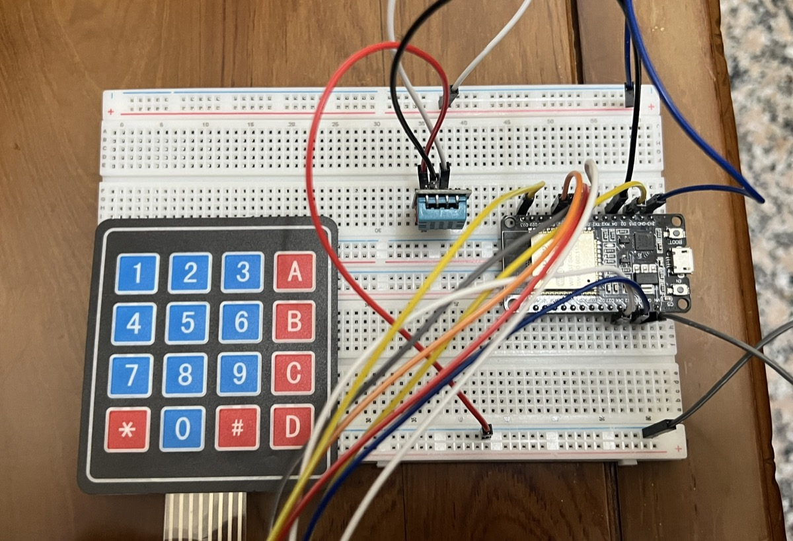
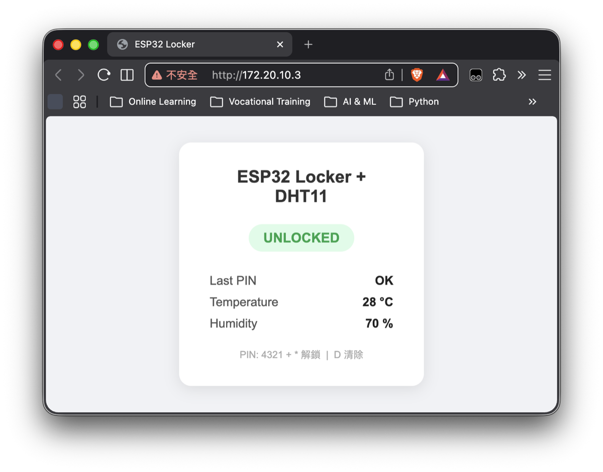
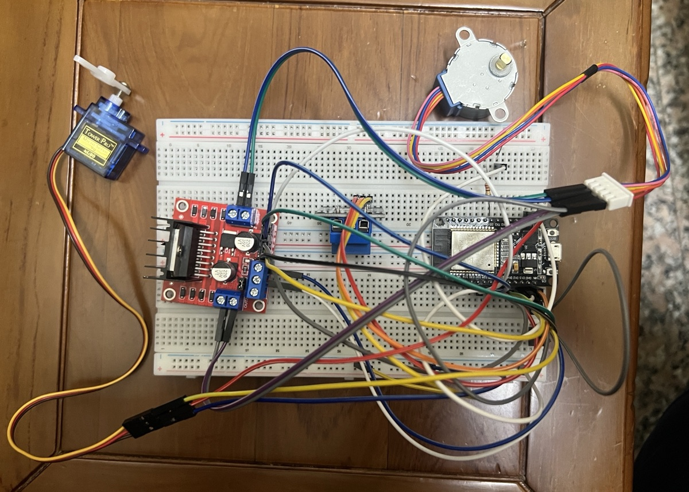

# esp32-module-lib

ESP32 MicroPython 模組範例庫。

## What I Built
45 種 ESP32 MicroPython 模組範例，依功能分 8 類（核心技術 / 感測器 / 輸出控制 / 人機介面 / 無線通訊 / 即時時鐘 / 整合範例 / 驅動庫），每個範例含難度分級。職訓課程期間整理，作為 ESP32 周邊控制的完整參考。

## Skills Demonstrated
- GPIO / ADC / PWM / 硬體中斷 / 深度睡眠 + 看門狗 / 雙核心
- I2C（LCD · OLED）· SPI（TFT ST7735）· UART
- 感測器：DHT11 · MQ-2 · ADXL335 · HX711 · MAX30100
- 輸出控制：繼電器 · 直流/步進/伺服馬達 · WS2812B · MAX7219
- 無線：WiFi · Web Server · MQTT · WebSocket · BLE · ESP-NOW · OTA

## Hardware / Interface
ESP32（30/38-pin）· GPIO · ADC · PWM · I2C · SPI · UART · WiFi · BLE
> 各款板子腳位差異請查板廠官方 pinout（本庫不附第三方接線圖）。

**實測板**：ESP32-D0WD-V3 rev3.1（NodeMCU-32S 30-pin）· 240MHz · MicroPython v1.28.0

## How to Run
1. 燒錄 MicroPython firmware 至 ESP32（[micropython.org](https://micropython.org/download/ESP32_GENERIC/)）；初次或清空重燒：`make erase && make flash`
2. 在根目錄 `Makefile`：`TARGET` 預設自動抓最近修改的 `.py`；`PORT` 自動掃描 `/dev/cu.usbserial-*`，通常不需手動設定
3. `make run` — 直接將腳本推送到板子並執行（不寫 flash），支援互動式指令輸入
4. 依範例頂部註解修改 PIN 腳與 WiFi 帳密後再執行

## Validation Status
**`advanced/keypad_dht11.py` 已在 ESP32-D0WD-V3 rev3.1 實機驗證通過**（4x4 Keypad + DHT11 + WiFi Web Server，PIN 解鎖、溫濕度顯示均正常）。

**`advanced/motor_console.py` 已實機驗證通過**（Relay + SG90 + LED + 28BYJ-48 步進馬達，序列指令互動控制均正常）。

其餘範例為課程學習整理，邏輯與結構已核對，未全數在實機上驗證；使用前請依實際板子與 MicroPython 版本測試調整。

| keypad_dht11 接線實照 | keypad_dht11 網頁截圖 | motor_console 接線實照 |
|----------------------|----------------------|----------------------|
|  |  |  |

---

## 模組總覽

### 核心技術 (`core-skills/`)

| 檔案 | 功能 | 難度 |
|------|------|------|
| `basics.py` | GPIO 基礎、LED、按鈕 | ⭐ |
| `adc.py` | ADC 類比輸入讀取 | ⭐ |
| `flash_storage.py` | Flash 掉電儲存設定值 | ⭐ |
| `interrupt.py` | GPIO 硬體中斷 | ⭐⭐ |
| `sleep_wdt.py` | 深度睡眠 + 看門狗計時器 | ⭐⭐ |
| `dual_core.py` | 雙核心分工（Core0 / Core1） | ⭐⭐⭐ |

### 感測器 (`sensors/`)

| 檔案 | 感測器 | 難度 |
|------|--------|------|
| `dht.py` | DHT11 溫濕度 | ⭐ |
| `analog_sensors.py` | 聲音 / 水位 / 雨水 / 火焰 / 光敏 | ⭐ |
| `pir_hall.py` | PIR 人體偵測 + 霍爾磁場感應 | ⭐ |
| `mq2.py` | MQ-2 煙霧 / 瓦斯偵測 | ⭐⭐ |
| `adxl335.py` | ADXL335 三軸加速度 | ⭐⭐ |
| `max471_hx711.py` | MAX471 電壓電流 + HX711 秤重 | ⭐⭐ |
| `max30100.py` | MAX30100 心率血氧 | ⭐⭐⭐ |

### 輸出控制 (`control/`)

| 檔案 | 功能 | 難度 |
|------|------|------|
| `pwm.py` | PWM 輸出（亮度 / 蜂鳴器） | ⭐ |
| `relay.py` | 繼電器控制（序列埠指令） | ⭐ |
| `servo.py` | 伺服馬達 0~180° | ⭐ |
| `dc_motor.py` | 直流馬達正反轉（L298N） | ⭐⭐ |
| `stepper.py` | 步進馬達精確控制 | ⭐⭐ |
| `ws2812b.py` | WS2812B 全彩 RGB 燈帶 | ⭐⭐ |
| `matrix_led_max7219.py` | 8x8 矩陣 LED（MAX7219） | ⭐⭐ |

### 人機介面 (`interface/`)

| 檔案 | 模組 | 難度 |
|------|------|------|
| `touch_sensor.py` | 電容式觸控 | ⭐ |
| `vibration.py` | 震動開關 | ⭐ |
| `dip_switch.py` | DIP 撥碼開關 | ⭐ |
| `i2c_lcd.py` | I2C LCD 16x2 | ⭐ |
| `seven_segment.py` | 七段顯示器 TM1637 | ⭐ |
| `keypad.py` | 4x4 矩陣鍵盤 | ⭐ |
| `ir_remote.py` | 紅外線遙控接收 | ⭐⭐ |
| `rotary_encoder.py` | 旋轉編碼器 | ⭐⭐ |
| `oled_ssd1306.py` | OLED SSD1306 128x64（I2C） | ⭐⭐ |
| `tft_st7735.py` | TFT 彩色螢幕 ST7735（SPI） | ⭐⭐ |

> `i2c_lcd.py` 需要 `lib/lcd_api.py` 和 `lib/machine_i2c_lcd.py`；`tft_st7735.py` 需要 `lib/st7735/` 目錄

### 無線通訊 (`networking/`)

| 檔案 | 功能 | 難度 |
|------|------|------|
| `wifi.py` | WiFi 連線 + 靜態 IP + NTP 對時 | ⭐ |
| `web_server.py` | HTTP Web Server（LED 控制、URL 參數） | ⭐⭐ |
| `async_web_server.py` | 非同步 Web Server（microdot）+ 靜態文件 | ⭐⭐ |
| `websocket.py` | WebSocket 雙向即時通訊 | ⭐⭐⭐ |
| `mqtt_publish.py` | MQTT 發布感測資料 + 自動重連 | ⭐⭐ |
| `mqtt_control.py` | MQTT 訂閱指令控制硬體 | ⭐⭐⭐ |
| `esp_now.py` | ESP-NOW 點對點無線通訊 | ⭐⭐⭐ |
| `bluetooth.py` | BLE + 傳統藍牙 SPP | ⭐⭐⭐ |
| `esp01.py` | ESP-01 AT 指令控制 | ⭐⭐ |
| `nrf24l01.py` | nRF24L01 2.4GHz 無線收發 | ⭐⭐ |
| `ota.py` | OTA 無線燒錄（WebREPL / HTTP 上傳） | ⭐⭐⭐ |

> `async_web_server.py` 需安裝 microdot：`mpremote mip install github:miguelgrinberg/microdot/src/microdot.py`

### 即時時鐘 (`time/`)

| 檔案 | 模組 | 難度 |
|------|------|------|
| `ds1302.py` | DS1302 RTC（精度較低） | ⭐ |
| `ds3231.py` | DS3231 RTC（溫度補償，更準確） | ⭐ |

### 整合範例 (`advanced/`)

| 檔案 | 功能 | 難度 |
|------|------|------|
| `keypad_dht11.py` | Keypad 門禁 + DHT11 Web Server，PIN 解鎖後網頁才顯示溫濕度 ✅ 實機驗證 | ⭐⭐⭐ |
| `keypad_scan.py` | 4x4 Keypad 診斷工具：印出實際 row/col 索引，用於校正 KEYMAP 接線方向 | ⭐ |
| `motor_console.py` | 序列指令控制台：Relay + SG90 + LED + 28BYJ-48 步進馬達，互動式輸入 ✅ 實機驗證 | ⭐⭐⭐ |

### 依賴庫 (`lib/`)

直接上傳到 ESP32 的 `/lib/` 目錄即可，不需修改。

| 路徑 | 說明 | 被誰使用 |
|------|------|----------|
| `lib/lcd_api.py` | I2C LCD 底層 API | `interface/i2c_lcd.py` |
| `lib/machine_i2c_lcd.py` | I2C LCD MicroPython 驅動 | `interface/i2c_lcd.py` |
| `lib/st7735/` | ST7735 TFT 驅動 + 字型 | `interface/tft_st7735.py` |

---

## 難度說明

| 符號 | 程度 |
|------|------|
| ⭐ | 入門：照程式碼改 PIN 腳就能用 |
| ⭐⭐ | 中等：需理解參數或搭配其他模組 |
| ⭐⭐⭐ | 進階：需額外設定或對通訊協定有基本了解 |
